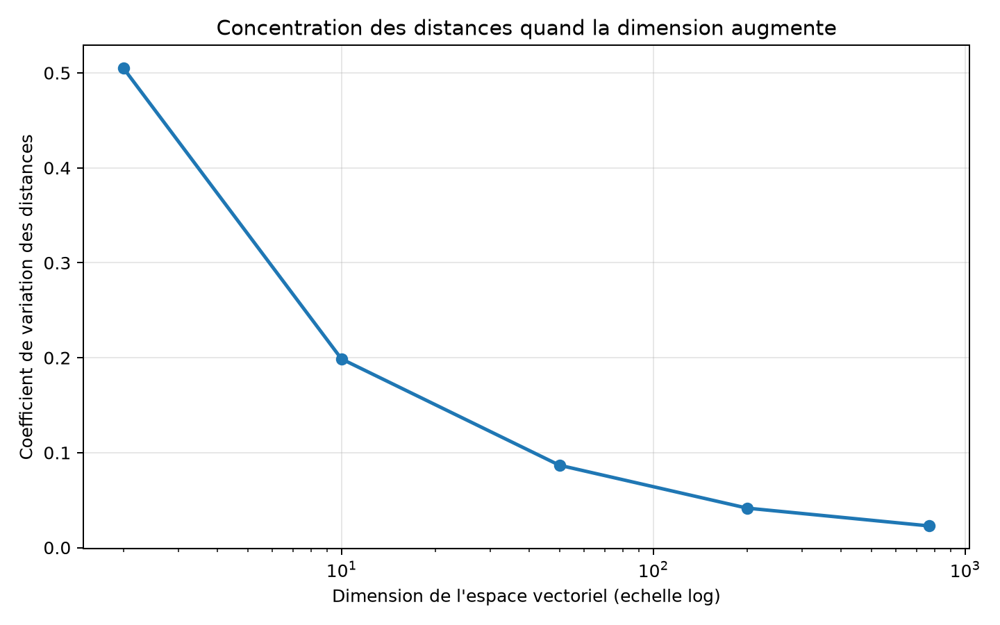
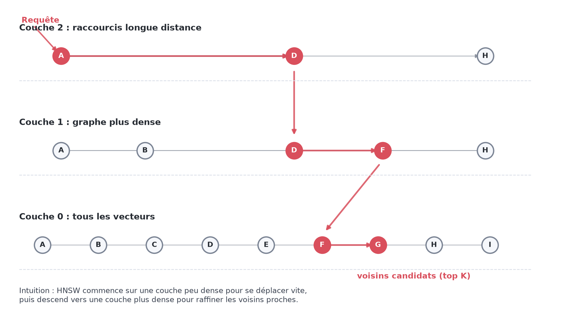
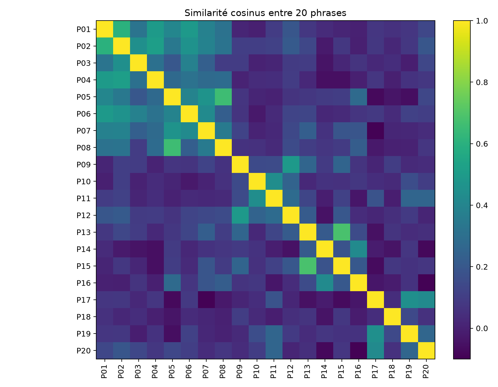
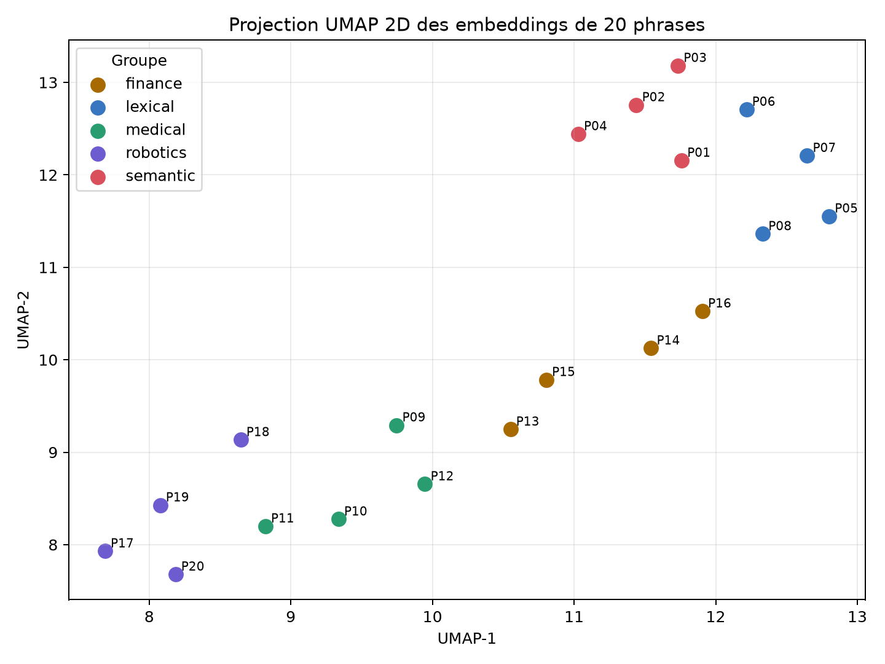
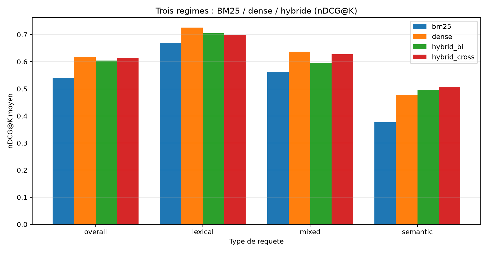
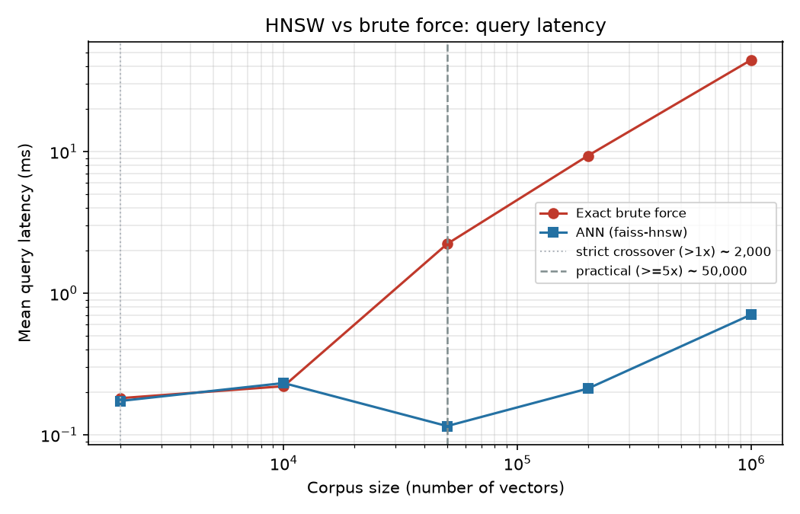
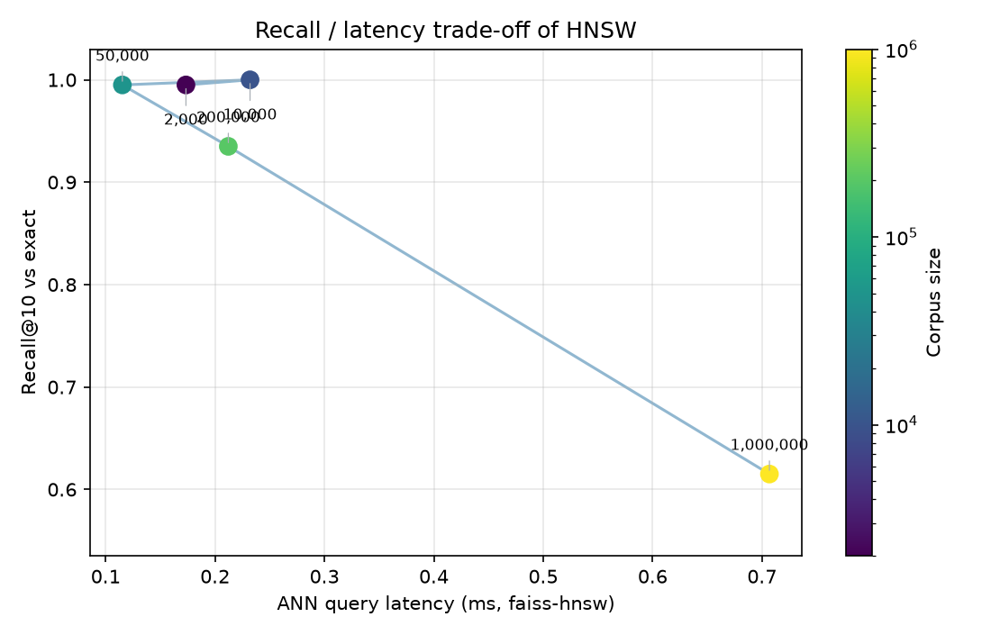

# Bases vectorielles et recherche sémantique : éprouver empiriquement le pipeline hybride et le passage à l'échelle de HNSW

## Introduction

La recherche documentaire moderne repose sur deux familles de méthodes que le cours d'algorithmie et d'ingénierie des données a présentées en détail : la recherche **lexicale** (BM25, index inversé) et la recherche **sémantique** par embeddings denses, indexée à grande échelle par des structures de plus proches voisins approchés (ANN) comme HNSW. Le cours est volontairement théorique : il pose les algorithmes, le pipeline hybride et les ordres de grandeur, mais il délègue explicitement la **mesure empirique** au travail de mémoire.

Notre mémoire ne cherche donc pas à ré-exposer cette théorie. Il prend deux affirmations que le cours énonce **sans les démontrer** et les met à l'épreuve sur un banc d'essai reproductible. Ces affirmations deviennent nos deux questions de recherche :

- **Question 1.** Le pipeline hybride « BM25 pour le rappel, puis re-ranking par embeddings » dépasse-t-il réellement chacune des deux approches prise seule, et si oui, sur quel type de requêtes ?
- **Question 2.** À partir de quelle taille de corpus l'index HNSW devient-il indispensable face à la recherche exacte, et à quel coût en rappel et en mémoire ?

Pour y répondre, nous avons construit un corpus synthétique de 2 000 résumés d'articles dont la pertinence est connue par construction, implémenté BM25 *from scratch* (adossé à un index inversé), une recherche dense exacte, un pipeline hybride à deux étages avec re-ranking (bi-encodeur, cross-encodeur réel, et repli déterministe), et un banc de passage à l'échelle de 2 000 à 1 000 000 de vecteurs. Toutes les mesures sont régénérables avec `random_state=42`.

La contribution du mémoire est donc moins une opposition « lexical contre sémantique » qu'une **mesure honnête de deux mécanismes** : un pipeline hybride et un index approché. Comme nous le verrons, les résultats sont nuancés — l'hybride ne gagne pas partout, le rappel de HNSW se dégrade à grande échelle — et c'est précisément cette nuance, expliquée, qui constitue l'apport.

## Contexte et motivation

Un système de recherche documentaire doit résoudre deux problèmes à la fois : un problème de **pertinence** (quels documents répondent vraiment à la requête ?) et un problème d'**échelle** (comment répondre vite sur des millions de documents ?). BM25 répond bien au premier quand les mots de la requête apparaissent dans les documents : il valorise les termes rares (IDF), sature la répétition d'un terme (`k1`) et corrige la longueur des documents (`b`). Il est rapide, explicable et robuste, ce qui explique sa présence dans Lucene/Elasticsearch.

Mais beaucoup de requêtes sont des **paraphrases** : l'utilisateur emploie des synonymes ou un vocabulaire plus général que les documents. Une approche purement lexicale ne sait pas que « conceptual inference » est proche de « semantic retrieval » si aucun mécanisme ne relie ces expressions. La recherche vectorielle répond à cette limite en représentant chaque texte par un **embedding** dense : deux textes proches par le sens deviennent proches géométriquement, et la recherche devient un problème de plus proches voisins. C'est le cœur des pipelines RAG, où seuls les passages les mieux classés sont transmis au modèle de langage [3].

Le cours va plus loin et affirme deux choses. D'abord, qu'un **pipeline hybride** — BM25 filtre un petit ensemble de candidats, puis les embeddings (ou un re-ranker) réordonnent ce petit ensemble — « dépasse les deux approches séparées ». Ensuite, que **HNSW** offre « 95 à 99 % de rappel avec un gain de vitesse de 100 à 1000× » sur de gros corpus, avec une complexité de requête de l'ordre de `O(d log n)` au lieu de `O(n d)` pour la force brute. Ces deux affirmations sont plausibles, mais le cours ne les construit ni ne les mesure. C'est ce vide que le mémoire comble.

## Fondements théoriques

### BM25 et index inversé

BM25 attribue à un couple (document `D`, requête `Q`) le score :

```text
score(D, Q) = somme sur q dans Q de IDF(q) * (f(q,D) * (k1 + 1)) /
              (f(q,D) + k1 * (1 - b + b * |D| / avgdl))
```

où `f(q,D)` est la fréquence du terme `q` dans `D`, `|D|` la longueur du document, `avgdl` la longueur moyenne, `k1=1,5` règle la saturation du *term frequency* et `b=0,75` la normalisation par longueur. L'IDF mesure la rareté du terme dans le corpus [5, 6].

Nous avons implémenté BM25 nous-mêmes (`BM25Index`) et l'avons adossé à un **index inversé** : chaque terme pointe vers la liste des couples `(document, fréquence)` qui le contiennent (*posting lists*). Le scoring ne visite alors que les documents contenant au moins un terme de la requête, au lieu de parcourir tout le corpus pour chaque terme. C'est la structure canonique de BM25, et elle rend l'étape de rappel lexicale peu coûteuse même quand le corpus grandit. Notre refonte conserve exactement la même formule et les mêmes classements que la version naïve — l'ordre d'accumulation par document est inchangé, donc les scores sont identiques au bit près, ce que vérifie un test d'équivalence dédié.

### Embeddings et similarité cosinus

Un embedding représente un texte par un vecteur dense de dimension fixe. La proximité se mesure par la similarité cosinus `cos(theta) = (u·v) / (||u|| ||v||)`, qui compare l'angle des deux vecteurs. Comme nous normalisons les vecteurs, `||u|| = ||v|| = 1` et le cosinus se réduit au produit scalaire `u·v`. L'encodeur principal est `sentence-transformers/all-MiniLM-L6-v2` (dimension 384) [2]. Un repli déterministe (`SemanticHashingEmbedder`) existe pour garder la démonstration lançable hors ligne ; il n'est **jamais** présenté comme un résultat principal, seulement comme un plan B technique.

### Pipeline hybride à deux étages

L'idée hybride combine les forces des deux signaux. **Étage 1 (rappel)** : BM25 récupère un petit ensemble de `N` candidats (ici `N = 50`) ; il est rapide et excellent pour attraper les correspondances de vocabulaire exact. **Étage 2 (re-ranking)** : un re-ranker réordonne uniquement ces `N` candidats pour produire le top-`K` final. Nous comparons trois re-rankers : un **bi-encodeur** (cosinus des embeddings déjà calculés, quasi gratuit), un **cross-encodeur** réel (`cross-encoder/ms-marco-MiniLM-L-6-v2`, qui score conjointement chaque paire requête-document) et un **repli déterministe** clairement étiqueté. Une propriété structurelle de ce schéma est centrale pour interpréter nos résultats : le re-ranking ne peut réordonner que les candidats de l'étage 1 — **un document pertinent absent du top-50 de BM25 est définitivement perdu**.

### Malédiction de la dimensionnalité et HNSW

La recherche exacte compare la requête à tous les vecteurs, pour un coût `O(n d)`. En haute dimension, les distances entre points aléatoires se **concentrent** : l'écart relatif entre le plus proche et la moyenne diminue, et les structures exactes (KD-tree, Ball Tree) éliminent de moins en moins de régions. Dans notre mesure de contrôle, le coefficient de variation des distances passe d'environ `0,505` en dimension 2 à `0,023` en dimension 768.



C'est ce qui motive l'ANN. HNSW organise les vecteurs en un graphe de proximité multi-couches [1] : les couches hautes contiennent peu de nœuds et servent de raccourcis, la couche basse contient tous les points. Une requête descend de couche en couche en se déplaçant vers les voisins qui réduisent la distance — un parcours proche d'un BFS, mais **guidé par une priorité de distance** et non exhaustif. Trois paramètres règlent l'index : `M` (nombre de voisins par nœud, donc mémoire et connectivité), `efConstruction` (effort de construction) et `efSearch` (nombre de candidats explorés par requête, qui arbitre rappel contre latence). L'implémentation principale utilise Faiss [4] ; un graphe de secours existe si Faiss est absent.



## Mise en œuvre

Le projet est organisé comme un petit paquet Python afin que le mémoire, la démonstration et les expériences partagent exactement le même code (et donc les mêmes résultats). Les modules principaux, dans `src/vector_search_memoire`, sont : `dataset.py` (génération du corpus et des requêtes, définition de la pertinence graduée), `bm25.py` (BM25 sur index inversé), `embeddings.py` (encodeur Sentence Transformers et repli déterministe), `vector_index.py` (recherche exacte, Faiss HNSW, graphe de secours), `hybrid.py` (pipeline à deux étages et re-rankers), `evaluation.py` (`precision@K`, `recall@K`, `nDCG@10`, `MAP`), `scale.py` (banc de passage à l'échelle) et `experiments.py` (orchestration). La démonstration Streamlit (`app.py`) ne recode aucun algorithme : elle appelle ces mêmes fonctions, ce qui évite toute divergence entre le code et les chiffres présentés.

Conformément à la consigne, nous commençons par une expérience introductive : encoder vingt phrases réparties en cinq groupes thématiques (recherche sémantique, recherche lexicale, médical, finance, robotique), puis calculer manuellement la matrice de similarité cosinus. La heatmap rend visible l'idée centrale du projet — les phrases d'un même groupe ont une similarité plus élevée — sans qu'aucune métrique de recherche ne soit encore en jeu.



Une projection UMAP en deux dimensions complète cette intuition. Elle ne prouve rien mathématiquement (réduire 384 dimensions à 2 perd de l'information), mais elle montre que les groupes thématiques tendent à se regrouper, ce qui prépare l'idée de recherche par voisinage dans l'espace vectoriel.



## Méthodologie d'évaluation

Avant de comparer quoi que ce soit, il a fallu **réparer la mesure**. Dans une première version, un document était jugé pertinent dès qu'il contenait le concept demandé (éventuellement dans le bon domaine). Cette règle était bien trop large : certaines requêtes avaient des centaines de documents pertinents sur 2 000, si bien que la `precision@5` saturait à `1,00` pour la majorité des requêtes et que la métrique ne distinguait plus les moteurs.

Nous avons resserré la pertinence en une **pertinence graduée de 0 à 3**, fondée sur quatre facettes : le **domaine thématique** (topic), la présence du **concept** cible, le fait que ce concept soit le **concept principal** du document (celui qui structure le titre) et la correspondance du **terme de domaine** précis. Le grade 3 — le « gold » — exige les quatre facettes alignées ; les grades 2 et 1 récompensent les correspondances partielles (bon sous-thème mais mauvais terme, ou concept présent mais secondaire). Après resserrement, le nombre de documents de grade 3 par requête est **raisonnable et dispersé** : minimum 3, médiane 11,5, maximum 20, moyenne 11,75 sur 2 000 documents. La `precision@K` ne sature plus et redevient informative.

Le choix du gain `2^grade − 1` pour le `nDCG` n'est pas anodin : il **amplifie** l'écart entre un résultat de grade 3 (gain 7) et un résultat de grade 1 (gain 1), de sorte qu'un moteur est davantage récompensé pour placer le *bon* document que pour aligner des résultats seulement adjacents. L'escompte `1/log2(rang+1)` pénalise les pertinents placés trop bas, et la normalisation par le classement idéal (`IDCG`) ramène la métrique entre 0 et 1, ce qui rend les requêtes comparables malgré des tailles de *gold* différentes. C'est cette combinaison — crédit partiel gradué et escompte de rang — qui permet au `nDCG@10` de distinguer des moteurs que la seule `precision@10` jugerait équivalents.

Sur cette base, nous utilisons quatre métriques implémentées *from scratch*. La `precision@K` et le `recall@K` (avec `K = 10`) reposent sur la pertinence binaire (grade 3). Le **nDCG@10** exploite les grades 0-3 comme gains (`gain = 2^grade − 1`), ce qui accorde un **crédit partiel** à un quasi-bon résultat et permet à la métrique de départager des moteurs qui atteignent la même précision. La **MAP** (mean average precision) récompense le fait de placer les pertinents tôt dans le classement. Un point méthodologique important : l'hybride ne peut classer que ses 50 candidats, alors que BM25 et le dense pourraient en classer davantage. Pour une comparaison équitable, **tous les régimes sont évalués à la même profondeur `N = 50`** ; la MAP rapportée est donc une **MAP@50**, comparable d'un régime à l'autre.

## Plongée 1 — Pipeline hybride et re-ranking

Nous évaluons quatre régimes sur les 20 requêtes annotées : **BM25 seul**, **dense seul** (cosinus exact), **hybride bi-encodeur** et **hybride cross-encodeur**. Les chiffres ci-dessous sont ceux lus dans `outputs/regime_summary.json` (encodeur `all-MiniLM-L6-v2`, cross-encodeur `ms-marco-MiniLM-L-6-v2`, `random_state=42`, `K = 10`, `N = 50`).

```text
Régime              P@10    R@10    nDCG@10   MAP@50
BM25 seul           0,330   0,274   0,540     0,262
Dense seul          0,365   0,297   0,617     0,346
Hybride bi-encodeur 0,350   0,291   0,605     0,272
Hybride cross-enc.  0,345   0,289   0,614     0,297
```



**Le résultat tel qu'il est.** L'hybride cross-encodeur **dépasse nettement BM25** (nDCG@10 0,614 contre 0,540, soit +0,074 ; MAP@50 0,297 contre 0,262) mais **ne dépasse pas le dense seul** en moyenne (0,614 contre 0,617 ; il lui est même très légèrement inférieur). Autrement dit, l'affirmation du cours « l'hybride dépasse les deux approches séparées » **n'est pas vérifiée globalement** sur notre banc. Nous ne maquillons pas ce résultat : c'est un résultat négatif, attendu et instructif.

**Pourquoi.** L'explication tient à la propriété structurelle décrite plus haut : l'hybride est **plafonné par le rappel de BM25 au premier étage**. Si un document pertinent n'est pas dans le top-50 lexical, aucun re-ranker ne peut le rattraper. Sur notre corpus synthétique propre, le dense seul est déjà très fort (il atteint un quasi-plafond) ; lui imposer un filtre lexical préalable ne peut donc, en moyenne, que **perdre du rappel** par rapport au dense pur. On le lit directement dans le tableau : le `recall@10` de l'hybride (0,289) est inférieur à celui du dense (0,297).

**Quand l'hybride gagne quand même.** La moyenne globale masque une structure nette quand on ventile par **style** de requête (champ `ndcg_by_style`) :

```text
nDCG@10 par style   BM25    Dense   Hybride cross
lexical             0,669   0,726   0,699
mixed               0,562   0,638   0,627
semantic            0,377   0,478   0,508
```

Sur les requêtes **sémantiques** (paraphrases, vocabulaire différent), l'hybride cross-encodeur (0,508) **dépasse à la fois BM25 (0,377) et le dense seul (0,478)**. C'est exactement le régime où lexical et sémantique sont complémentaires : BM25 garantit que le bon domaine est représenté dans les 50 candidats, et le cross-encodeur, qui lit la paire (requête, document) conjointement, départage finement le sens. Sur les requêtes lexicales et mixtes, en revanche, le dense seul reste devant.

Les classements individuels illustrent ce double visage du re-ranking (champ `rerank_changes`). Sur `Q06` (« spotting rare unusual events in network traffic », style sémantique), le re-ranking fait gagner à BM25 un `nDCG@10` de `+0,31` : le re-ranker remonte les bons documents que BM25 avait noyés dans ses candidats. Sur `Q13` (segmentation d'audience, sémantique), la `MAP` gagne `+0,30`. À l'inverse, sur `Q02` (« precedent search across court decisions », style mixte), le re-ranking **dégrade** BM25 de `−0,39` en `nDCG@10` : ici BM25 avait déjà bien classé ses candidats et le re-ranker, en réordonnant, casse un bon ordre lexical. Sur les 20 requêtes, le re-ranking modifie le classement de BM25 dans 40 cas (les deux variantes confondues) ; le cross-encodeur est plus souvent bénéfique que le bi-encodeur, conformément à l'intuition qu'un modèle qui co-encode la paire requête-document est plus discriminant qu'un simple cosinus.

La réponse à la Question 1 est donc nuancée : **l'hybride bat BM25, fait jeu égal avec le dense en moyenne, et ne dépasse réellement les deux que sur les requêtes sémantiques.** Sa valeur n'est pas un gain uniforme mais une robustesse ciblée là où le lexical seul échoue.

## Plongée 2 — Passage à l'échelle de HNSW

Pour exhiber le point de bascule entre force brute et HNSW, nous mesurons la latence de requête, le rappel@10 (face à la recherche exacte), le temps de construction et l'empreinte mémoire pour des corpus de **2 000 à 1 000 000 de vecteurs** en dimension 384 (comme `all-MiniLM-L6-v2`). Pour cette partie, des **vecteurs synthétiques** suffisent : la latence et le rappel dépendent du nombre de vecteurs et de la géométrie de l'espace, pas du texte sous-jacent. Point méthodologique essentiel pour **isoler l'effet de la taille** : nous générons **un seul corpus maximal** (centroïdes, nombre de clusters et dispersion **fixes**) et chaque taille est un **préfixe** de ce corpus, avec le même jeu de requêtes. Seul le nombre de vecteurs change d'une ligne à l'autre. Les paramètres HNSW sont fixes (`M = 32`, `efSearch = 80`). Les chiffres proviennent de `outputs/scale_benchmark.csv`.

```text
Corpus        Speedup HNSW   recall@10   Mémoire (brut -> index)
2 000         1,2x           0,995       3 -> 4 Mo
10 000        1,2x           1,000       15 -> 18 Mo
50 000        14,3x          0,980       77 -> 90 Mo
200 000       40,8x          0,890       307 -> 362 Mo
1 000 000     48,2x          0,750       1 536 -> 1 808 Mo
```



**Le point de bascule.** Il faut distinguer deux notions. La bascule **stricte** (HNSW simplement plus rapide que l'exact) arrive dès ~2 000 vecteurs, mais elle est trompeuse : le gain n'y est que de 1,2× et la recherche exacte est de toute façon instantanée. La bascule **pratique** (gain opérationnellement significatif, fixé à ≥ 5×) arrive vers **50 000 vecteurs** : HNSW y est 14× plus rapide à un rappel@10 de 0,98, puis le gain atteint **48× à un million** de vecteurs. C'est la démonstration de la raison d'être de HNSW : le passage d'une complexité linéaire à une complexité quasi-logarithmique se voit dès que le corpus dépasse quelques dizaines de milliers de documents.



**Le coût, expliqué honnêtement.** Le rappel n'est pas gratuit : il descend de 0,98 (50k) à 0,89 (200k) puis 0,75 (1M). Deux raisons se cumulent. D'abord, les paramètres HNSW sont **fixes** : à `efSearch = 80`, l'index explore un nombre constant de candidats alors que le corpus grandit ; il faut donc augmenter `efSearch` à grande échelle pour maintenir le rappel — ce qui se paie en latence (le compromis se visualise dans l'onglet dédié de la démonstration, où monter `efSearch` fait remonter le rappel). Ensuite, nos vecteurs sont **synthétiques** : même avec une structure de clusters, ils sont moins richement organisés que de vrais embeddings, sur lesquels HNSW atteint plus facilement le régime 95-99 % annoncé par le cours. Comme notre protocole tient la distribution fixe (préfixes d'un même corpus), la baisse de rappel est bien un **vrai effet de volume à `efSearch` constant**, et non un artefact de changement de distribution. Enfin, l'index sérialisé pèse environ **18 % de plus** que la matrice brute (1 808 contre 1 536 Mo à un million), surcoût du graphe de voisinage.

**Construction et stabilité des mesures.** Le banc enregistre aussi le temps de construction de l'index et l'écart-type des latences (8 répétitions par requête). La construction de HNSW croît fortement avec la taille — de l'ordre de la centaine de millisecondes à 2 000 vecteurs, mais environ **77 secondes** à un million — ce qui rappelle que HNSW déplace une partie du coût vers l'indexation : on construit une fois, on interroge souvent. Les écarts-types de latence restent faibles devant les moyennes (par exemple, la force brute à un million mesure `35,3 ± 1,0` ms), ce qui indique des mesures stables ; nous insistons toutefois sur le fait que ces temps sont **machine-dépendants** (les versions et le matériel sont consignés dans `scale_benchmark_meta.json`) et que seuls les **ratios** entre force brute et HNSW sont à interpréter.

La réponse à la Question 2 est donc : **HNSW devient pratiquement indispensable autour de 50 000 vecteurs et offre jusqu'à ~48× d'accélération à un million** ; le coût est une perte de rappel à `efSearch` fixe (que l'on récupère en explorant plus de candidats, au prix de la latence) et un surcoût mémoire d'environ 18 %.

## Discussion et limites

La première limite est le **corpus synthétique** et sa vérité-terrain construite par règle. C'est un choix assumé : il fait du projet un **banc d'essai contrôlé**, conçu pour exhiber des *régimes* (quand l'hybride aide, quand HNSW bascule), pas pour mesurer des *magnitudes* d'un corpus industriel réel. Nous défendons donc des tendances, pas des valeurs absolues.

La deuxième limite est le **plafond de rappel du premier étage** de l'hybride, discuté plus haut : il borne mécaniquement ce que le re-ranking peut récupérer. Une variante (fusion des candidats BM25 *et* denses avant re-ranking) lèverait ce plafond ; nous l'avons gardée hors périmètre pour respecter la définition stricte « BM25 → re-ranking ».

La troisième limite est la **dépendance du verdict hybride à la force de l'encodeur**. Avec le repli déterministe, faible, l'hybride bat tout le monde — précisément parce que le dense seul y est mauvais. C'est pourquoi les chiffres de référence du mémoire sont ceux du **vrai cross-encodeur** et du vrai modèle d'embeddings, jamais ceux du repli. Le tableau de bord enregistre d'ailleurs explicitement si un repli a été utilisé, pour qu'un résultat de repli ne puisse jamais être pris pour un résultat cross-encodeur.

La quatrième limite est le **réglage de HNSW à grande échelle** : nos mesures utilisent un `efSearch` fixe ; un déploiement réel ajusterait `efSearch` (et `M`) à la taille pour viser un rappel cible. Enfin, il faut distinguer **similarité sémantique et vérité** : un embedding peut rapprocher deux textes du même thème sans que l'un réponde à la requête, limite importante en RAG.

## Conclusion

Ce mémoire a éprouvé deux affirmations que le cours pose sans les mesurer. Sur la **Question 1**, le pipeline hybride BM25 → re-ranking dépasse BM25 seul mais **ne dépasse pas le dense seul en moyenne** sur notre banc ; il ne bat les deux que sur les requêtes **sémantiques**, parce que son rappel est plafonné par l'étage lexical. Sur la **Question 2**, HNSW devient pratiquement indispensable autour de **50 000 vecteurs** et accélère jusqu'à ~**48×** à un million, au prix d'une perte de rappel à paramètres fixes (récupérable via `efSearch`) et d'un surcoût mémoire d'environ 18 %.

La leçon d'ensemble n'est pas qu'un mécanisme domine, mais que **chacun a un domaine de pertinence précis** : BM25 pour le lexical exact, le dense pour le sens, l'hybride pour les requêtes sémantiques où les deux signaux se complètent, et HNSW pour rendre tout cela utilisable à l'échelle. Il n'y a pas de balle d'argent ; il y a des régimes, et la valeur d'un mémoire empirique est de les délimiter avec des chiffres.

## Bibliographie

[1] Malkov, Y. A., & Yashunin, D. A. (2018). *Efficient and robust approximate nearest neighbor search using Hierarchical Navigable Small World graphs*. arXiv:1603.09320. https://arxiv.org/abs/1603.09320

[2] Reimers, N., & Gurevych, I. (2019). *Sentence-BERT: Sentence Embeddings using Siamese BERT-Networks*. EMNLP 2019. https://arxiv.org/abs/1908.10084

[3] Lewis, P., Perez, E., Piktus, A., et al. (2020). *Retrieval-Augmented Generation for Knowledge-Intensive NLP Tasks*. NeurIPS 2020. https://arxiv.org/abs/2005.11401

[4] Douze, M., Guzhva, A., Deng, C., Johnson, J., et al. (2024). *The Faiss library*. arXiv:2401.08281. https://arxiv.org/abs/2401.08281

[5] Manning, C. D., Raghavan, P., & Schütze, H. (2008). *Introduction to Information Retrieval*, section « Okapi BM25 ». Cambridge University Press. https://nlp.stanford.edu/IR-book/html/htmledition/okapi-bm25-a-non-binary-model-1.html

[6] Robertson, S., & Zaragoza, H. (2009). *The Probabilistic Relevance Framework: BM25 and Beyond*. Foundations and Trends in Information Retrieval.

[7] Nogueira, R., & Cho, K. (2019). *Passage Re-ranking with BERT*. arXiv:1901.04085. https://arxiv.org/abs/1901.04085

[8] Järvelin, K., & Kekäläinen, J. (2002). *Cumulated gain-based evaluation of IR techniques (nDCG)*. ACM TOIS, 20(4).

[9] pgvector. *Open-source vector similarity search for Postgres*. https://github.com/pgvector/pgvector

## Démarche de travail

Le projet a été développé en Python autour d'un petit paquet réutilisable, avec une graine fixée (`random_state=42`) pour garantir la reproductibilité. Nous nous sommes appuyés sur des bibliothèques standard du domaine — `sentence-transformers` pour les embeddings, Faiss pour l'index HNSW, NumPy pour le calcul et Streamlit pour la démonstration — et nous avons implémenté nous-mêmes les briques que le mémoire doit pouvoir expliquer : BM25 sur index inversé, les métriques nDCG@10 et MAP, et le pipeline hybride à deux étages. Chaque chiffre présenté a été régénéré et contrôlé localement à partir des fichiers de `outputs/`, et les affirmations théoriques ont été recoupées avec les articles et documentations cités, de manière à pouvoir défendre chaque choix et chaque résultat nuancé pendant la soutenance.
